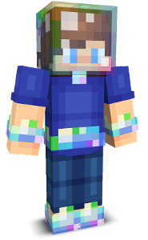
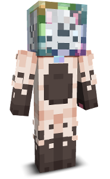
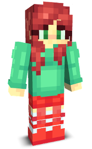
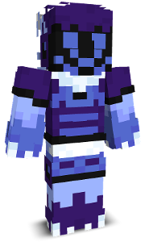
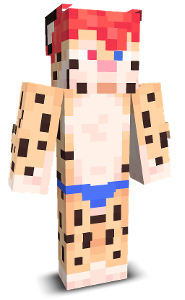
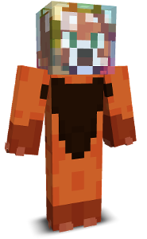
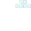
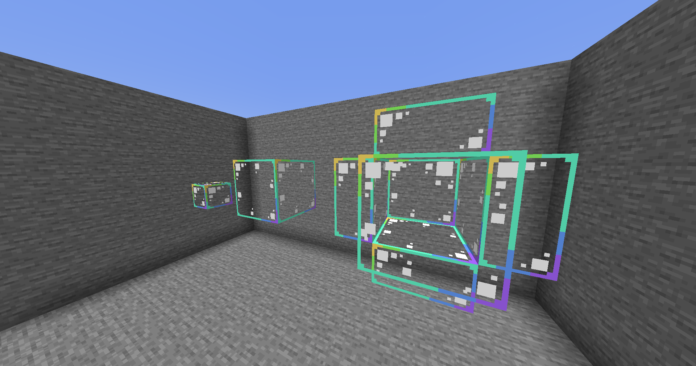
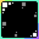

I occasionally make things within Minecraft. Skins, textures, builds; you name it, I've probably touched up on it at one point.



## Skins







## Free Download: Bubblehead

Put this over your Minecraft skin's head to have a bubble on it. Don't worry about it ever coming off, it's already fused itself to your neck and it'll never pop no matter what you throw at it~ ;3c

<!--  -->
  


<a href="/bubblehead.png" download>[⤓ Download]</a>




## Resource Pack: Bubble Glass

Replaces regular glass (and glass panes) with bubble film instead. Supports CTM mods such as [Continuity](https://modrinth.com/mod/continuity) and [Optifine](https://optifine.net/home) for that nice, bubble film-like look :3


<a href="https://github.com/AllBubbledUp/resource-packs/raw/main/Bubble%20Glass%20v1.0.zip" download>[⤓ Download]</a>

