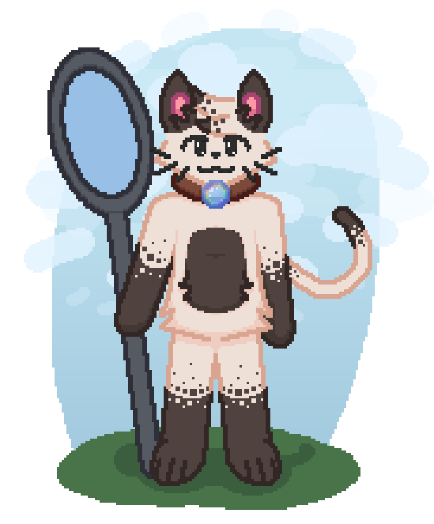







- **Pronouns:** He/Him
- **Height:** 5'6 (168 cm)

## Physical Description

Daimie is an anthropomorphized housecat with primarily tan fur, with brown fur around his stomach, forepaws, and ears. His tail alternates between brown, tan, and brown again. Each transition in fur color has spots.

Around his neck is a leather collar with a bubble pendant in the center.

## Lore

{{
}}
{{
}}
The breeze was cool and the sun was falling in the sky. On his way back home, Daimie noticed a strange clearing into a secluded area of a small park. Being the curious cat he was, he decided to follow it deeper and deeper into the wooded area. In the middle of the clearing was a floating bubble, a brown leather collar with a bubble on it sat inside. He walked around the bubble, inspecing it at all angles. Eventually, he gave it a quick poke. Instead of bursting, the bubble just wobbled in place. The pokes became prods, the prods became baps, and the baps became grabs. Eventually, he pulled the bubble up to his eyes to inspect the collar inside up close. Right then, with his guard down, the bubble struck, slamming itself against his face, immediately *fwoomping* his head in and attaching the collar to his neck.

At that point, he was cursed. The bubble was stuck to the collar, and the collar was stuck to his neck. His entire body went into disarray, the curse taking effect nearly immediately. His fur began boiling with soapy foam, he began having hiccups with each hic causing a large bubble to fly out of his mouth, 
{{
}}
{{
}}

- The collar around his neck is cursed. Whenever put on, it's immediately bound to the wearer's body and can never be taken off as long as he lives.
  - In worlds with a system of magic, any magic energy he gains is immediately sapped out of his body through the collar. This makes him completely unable to learn new spells.

## Abilities

Due to his bubble collar, Daimie has a few bubble-related abilities. However, he still has poor control over these powers and can occasionally malfunction during periods of dyscontrol, typically just when he's either ill or experiencing an emotional flare-up.

- **Bubble Breath** - Daimie can blow bubbles directly from his mouth.
    - During moments of dyscontrol, Daimie may accidentally form some bubbles. The amount, size, and frequency of bubbles depends on the cause, intensity, and duration. For surprise, it could just be a few small bubbles popping out. For an intense fever, he might be streaming bubbles out of his mouth, nose, and ears for a bit.
- **Bubble Manipulation** - Daimie, with enough control, can change the shape and physics of his own bubbles.
- **Foamy Body** - Daimie's body will start foaming up with soap bubbles whenever irritated.
    - His fur may foam on its own at times when a normal human body would sweat instead.
- Abilities
- Abilities
- Abilities
- Abilities
- Abilities
- Abilities
- Abilities
- Abilities