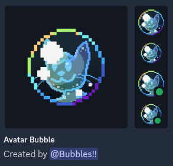

This was a small project I worked on in a private Discord server for bubblebrains like myself. It originally started off in a friend's DMs, with the original version being just the bubbles until I teased them with...

...and then I did just that, I stuffed their sona into some of the bubbles.

After that, I sent a preview into a mutual Discord server and asked others who would like their own characters in bubbles to send their references. Around twenty people later, here we are.



## Notes

### Instructions

- Hold <abbr title="Bound to [z] on Desktop by default">[A]</abbr> to spawn more bubbles.
- Hold <abbr title="Bound to [x] on Desktop by default">[B]</abbr> to show more information.
- Press <abbr title="Bound to [a] on Desktop by default">[X]</abbr> to pause the floatiness.
- Use <abbr title="Bound to [↑] on Desktop by default">[▲]</abbr>/<abbr title="Bound to [↓] on Desktop by default">[▼]</abbr> to change the speed of the simulation, including reversing it.
- Use <abbr title="Bound to [←] on Desktop by default">[◀]</abbr>/<abbr title="Bound to [→] on Desktop by default">[▶]</abbr> to select a person to trap and press <abbr title="Bound to [s] on Desktop by default">[Y]</abbr> to send them flying up :3c.

### Credits

The following characters are now flying into the skies forever because their creators requested it.*

{{
}}
- **Chaotic**  
2chaotic, [FurAffinity](https://www.furaffinity.net/user/2chaotic/)
- **Bubbles**  
Me!, [Neocities](https://allbubbledup.neocities.org/)
- **Goldie**  
GoldLinaric, [DeviantArt](https://www.deviantart.com/goldlinaric)
- **Cyblesop**  
CyblesopSudonia, [DeviantArt](https://www.deviantart.com/cyblesopsudonia)
- **Vap**  
-jos, [FurAffinity](https://www.furaffinity.net/user/-jos/)
- **Jessi**  
IncensedShedinja, [DeviantArt](https://www.deviantart.com/incensedshedinja)
- **Rowen**  
Crirex, [FurAffinity](https://www.furaffinity.net/user/crirex/)
- **Pomf**  
helioshigh, [DeviantArt](https://www.deviantart.com/helioshigh)
- **Sonder**  
soccertruck, [FurAffinity](https://www.furaffinity.net/user/soccertruck/)
- **Kayiun**  
Kinipharian, [DeviantArt](https://www.deviantart.com/kinipharian)
- **Xeltios**  
Xeltios, [FurAffinity](https://www.furaffinity.net/user/xeltios/)
- **Ryu**  
RyuCas, [FurAffinity](https://www.furaffinity.net/user/ryucas/)
- **Suds**  
@crankycroc, [Discord](https://discord.com/users/138502770410913793)
- **Osanawo**  
The8Madness, [DeviantArt](https://www.deviantart.com/the8madness)
- **Swain**  
@swain.exe, [Discord](https://discord.com/users/177176197707333633)
- **Lola**  
Sny-por, [DeviantArt](https://www.deviantart.com/sny-por)
- **Spoof**  
@spoofthepooltoy, [Discord](https://discord.com/users/430536535419387945)
- **Diamond Angel Dragon**  
@diamondthedutch2023, [Discord](https://discord.com/users/277968058042155020)
- **Autumn**  
AutumnEclipse1618, [FurAffinity](https://www.furaffinity.net/user/autumneclipse1618/)
- **Evy**  
NaveGreb, [DeviantArt](https://www.deviantart.com/navegreb)
- **Milson**  
bendovaboi, [FurAffinity](https://www.furaffinity.net/user/bendovaboi/)
- **Jax**  
11buddy24, [FurAffinity](https://www.furaffinity.net/user/11buddy24/)
- **Amora**  
WildBubbleFantasy, [DeviantArt](https://www.deviantart.com/wildbubblefantasy)
{{
}}

\* Well, Chaotic didn't request it, I just stuffed him in a bubble to tease him in DMs :3c



## Play Project

This content is viewed best on a desktop computer. If on a mobile device, you may want to find a desktop before continuing.



<a href="https://github.com/AllBubbledUp/tic80-carts/raw/main/bubbles/bubbles.tic" download>[⤓ Download]</a>



## Bonus: Discord Avatar Decoration

I also made the bubble from this project into a Discord avatar decoration! You can use Decor, a Discord mod allowing users to set custom avatar decorations, to apply it.

<a href="./bubble-avatardeco.png" download>[⤓ Download]</a>